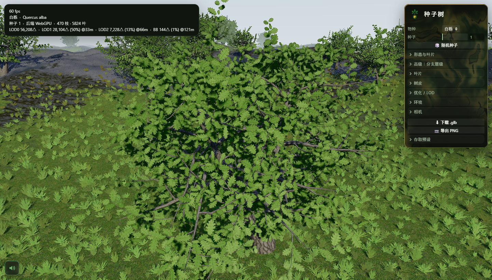
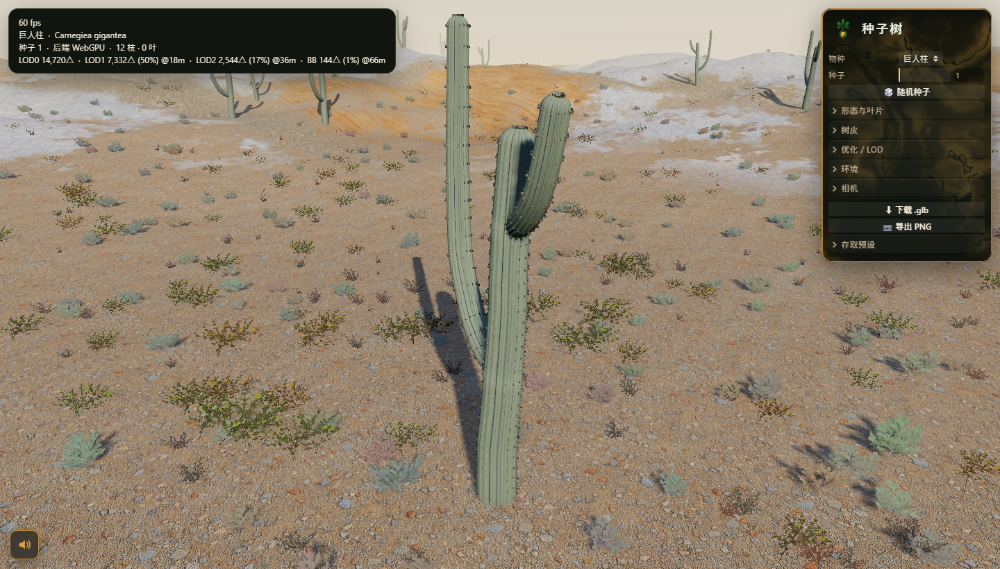

<div align="center">

# 🌱 种子树



> *「一粒种子，一套滑块，长出一整片森林。」*

[](LICENSE)
[](https://threejs.org)
[](https://zhongzishu.bluecatbot.com)
[](https://vitejs.dev)

<br>

**在浏览器里选一个物种、拖几下滑块，就长出一株独一无二、带真实贴图、随风摆动的 3D 树——十个物种横跨森林与沙漠，一键导出 `.glb`，全程 60fps。**

<sub>纯程序化生成，零外部素材。基于 Three.js 的 WebGPU 渲染，新版 Chrome / Edge 直接跑（自动 WebGL2 回退）。</sub>

<br>

不用建模、不用找素材、不用装软件。<br>
打开网页，选「白栎」还是「巨人柱」，调树冠、分枝、虬曲、风力，换个种子就是另一棵。<br>
满意了，一键导出 glTF，丢进你的 Three.js / Blender / 游戏引擎。

[▶ 在线体验](https://zhongzishu.bluecatbot.com) · [看效果](#看效果) · [本地运行](#本地运行) · [十个物种](#十个物种) · [工作原理](#工作原理)

</div>

---

## 看效果

同一个引擎，两个生态群落——**温带森林**的阔叶橡树，和**沙漠**里的巨人柱仙人掌，全部实时程序化生成、可调、可导出：

<p align="center">
  
  
</p>

- **选物种** → 白栎 / 红花槭 / 巨人柱 / 短叶丝兰…… 十选一
- **调参数** → 树冠形状、分枝密度、虬曲度、叶片、风力、太阳，拖滑块实时重生
- **换种子** → 同一物种，无限变体，没有两棵一样
- **调 LOD** → LOD0 完整几何 → 广告牌替身，四级一条链，眼看着三角形往下掉
- **导出** → 一键 `.glb`，含逐 LOD 网格 + 标准材质扩展

**这不是贴图预设——每一株的枝干走向、叶片朝向、棱脊硬刺，都是当场算出来的。**

---

## 在线体验

**▶ [zhongzishu.bluecatbot.com](https://zhongzishu.bluecatbot.com)** —— 打开就能玩，无需安装。

> 需要支持 WebGPU 的浏览器（Chrome / Edge 113+），有 WebGL2 自动回退。

---

## 本地运行

```bash
pnpm install
pnpm dev        # http://localhost:5390
```

拖拽环绕视角；右侧面板选物种、调参数、导出 `.glb`；左下角喇叭切换环境音。

```bash
pnpm build      # 产物在 dist/
```

---

## 它能做什么

| | |
|---|---|
| 🌳 **十个物种、两个群落** | 温带阔叶/针叶 8 种 + 沙漠多肉 2 种，每种照参考照片调形态 |
| 🎛️ **实时可调** | 树冠 / 分枝 / 虬曲 / 叶片 / 树皮 / 风 / 太阳，拖滑块即时重生 |
| 🌱 **无限变体** | 换个种子就是另一棵，程序化生成不重样 |
| 🍃 **真实叶片** | 单叶 / 针叶簇卡片 + 背光透光（次表面散射）+ 逐实例风动 |
| 📉 **LOD 链 + 替身** | 四级 LOD（含广告牌替身），Web Worker 离线烘焙不卡顿 |
| 🌍 **有生命的场景** | 实例化森林、草、岩石、PBR 地形、云、可移动太阳、环境音 |
| 📦 **一键 glTF** | 导出 `.glb`（逐 LOD 网格 + `KHR_materials_*`），丢进任何引擎 |
| 🔌 **零外部素材** | 纹理 / 音频随仓库附带，克隆即跑；纯程序化，无外链 |

---

## 十个物种

| | 物种 | 学名 | 群落 | 生成器 |
|---|---|---|---|---|
| 🔥 | **白栎** | *Quercus alba* | 温带 | Weber–Penn |
| | 红花槭 | *Acer rubrum* | 温带 | Weber–Penn |
| | 北美鹅掌楸 | *Liriodendron tulipifera* | 温带 | Weber–Penn |
| | 北美枫香 | *Liquidambar styraciflua* | 温带 | Weber–Penn |
| | 美国水青冈 | *Fagus grandifolia* | 温带 | Weber–Penn |
| | 西黄松 | *Pinus ponderosa* | 温带 | Weber–Penn |
| | 火炬松 | *Pinus taeda* | 温带 | Weber–Penn |
| | 花旗松 | *Pseudotsuga menziesii* | 温带 | Weber–Penn |
| 🌵 | **巨人柱** | *Carnegiea gigantea* | 沙漠 | L 系统 |
| 🌵 | **短叶丝兰** | *Yucca brevifolia* | 沙漠 | L 系统 |

想加不在列表里的树？不用改引擎——写一份预设 + 生成几张纹理即可（流程见 `docs/` 与项目 `CLAUDE.md`）。

---

## 工作原理

一株树从「一个物种预设」到「可导出的 3D 网格」，中间是这四步：

**1. 两套生成器。** 阔叶树与针叶树走 **Weber–Penn** 参数化模型（分枝角度、锥化、树冠形状照参考照片调）；沙漠多肉走一套从零实现的**二叉 L 系统**（合并管状网格、棱脊、刺座硬刺）——它们不是「枝—叶」型的树，得换套语法。

**2. 叶片即卡片。** 基部锚定的单叶 / 针叶簇卡片，带背光透光、穹顶法线树冠着色、逐实例风动。

**3. LOD 链 + 替身。** LOD0 完整几何 → 精简几何 LOD1 → 烘焙分支卡片 LOD2 → 两片交叉广告牌替身；替身在 Web Worker 离线烘焙，观感永不卡顿。

**4. 一键导出。** 逐 LOD 网格合并写成 `.glb`，带标准 `KHR_materials_*` 扩展（含叶片透射），任何 glTF 管线都认。

想深入沙漠多肉的 L 系统语法，看 [`docs/dichotomous-generator.md`](docs/dichotomous-generator.md)。

---

## 诚实边界

- **早期 alpha（v0.1）**：能玩、能导出，但部分地方粗糙，有毛边。
- **要 WebGPU**：主路径是 WebGPU（Chrome / Edge 113+）；WebGL2 回退可用但非最佳。
- **不是植物学标本**：形态照参考照片调，追求「像那么回事」而非严格植物学精确。
- **十个物种是起点**：想要别的树，自己加（写预设 + 生成纹理）。

---

## 背后的故事

种子树改自开源项目 **[SeedThree](https://github.com/SkyeShark/SeedThree)**（SkyeShark，MIT）——把它做成了**中文版**：界面、物种名、文档全中文，保留拉丁学名，去掉外链，上线可玩。

名字很直白：**一粒种子（Seed），长成一棵树。** 你给它一个物种和一个随机数，它替你把从种子到树冠的每一根枝条都算出来。

程序化的好处，是它不占素材、不断链、无限不重样——一个 `.glb`，换个种子又是一片新森林。

---

## 关于作者 & 也在做

**蓝猫 · BlueCat** —— AI-native builder，把想法快速做成能上线玩的东西。

| | |
|---|---|
| 🐙 GitHub | [@shushuitie2017](https://github.com/shushuitie2017) |
| 🌐 作品总览 | [bluecatbot.com](https://bluecatbot.com) |

**也在做**：[GameBox](https://gamebox.bluecatbot.com) —— 74 个浏览器 3D 游戏「积木」模块，同一套 3D 底子，给编码代理组合改写。

---

## 许可证

**MIT —— 随便用，随便改，随便造。**

---

<div align="center">

**一粒种子，一套滑块，长出一整片森林。**<br><br>

▶ [**zhongzishu.bluecatbot.com**](https://zhongzishu.bluecatbot.com)

</div>

---

## English

> *"A seed, a set of sliders, a whole forest."*

**种子树 (zhongzishu)** is a browser-based **procedural tree & plant generator** built on Three.js (WebGPU) — the Chinese edition of [SeedThree](https://github.com/SkyeShark/SeedThree). Pick a species, tune the parameters, and grow a unique, textured, wind-animated 3D tree — **ten species across forest and desert, one-click glTF export, 60fps.**

**▶ Live: [zhongzishu.bluecatbot.com](https://zhongzishu.bluecatbot.com)** (WebGPU browser — Chrome / Edge 113+)

```bash
pnpm install && pnpm dev     # http://localhost:5390
```

Two generators under the hood — a Weber–Penn parametric model for broadleaves & conifers, a from-scratch dichotomous L-system for desert succulents. Fully procedural, zero external assets, exports `.glb` with per-LOD meshes and standard material extensions. **Not textured presets — every branch, leaf, and rib is computed.**

MIT © SkyeShark (original SeedThree) · Chinese fork by BlueCat.
